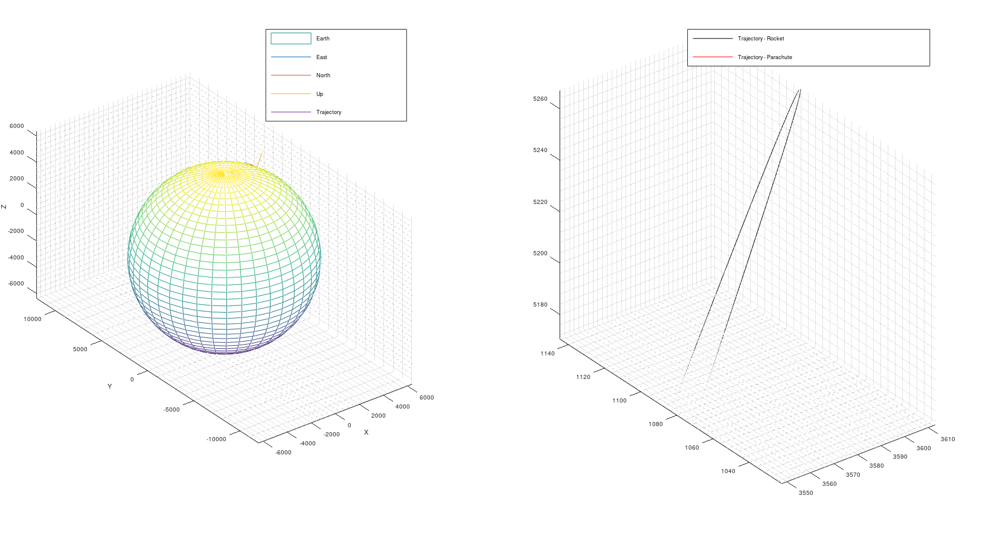
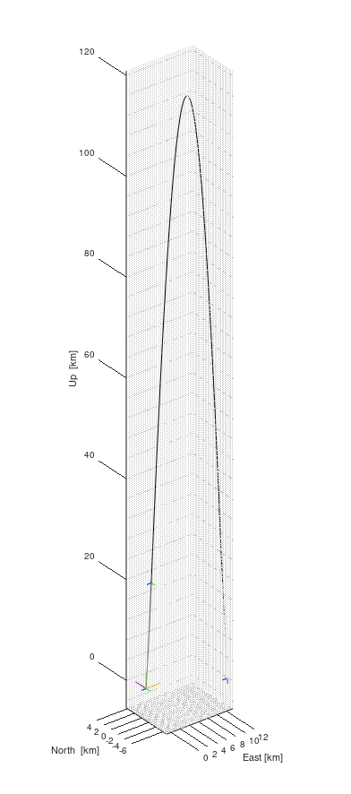
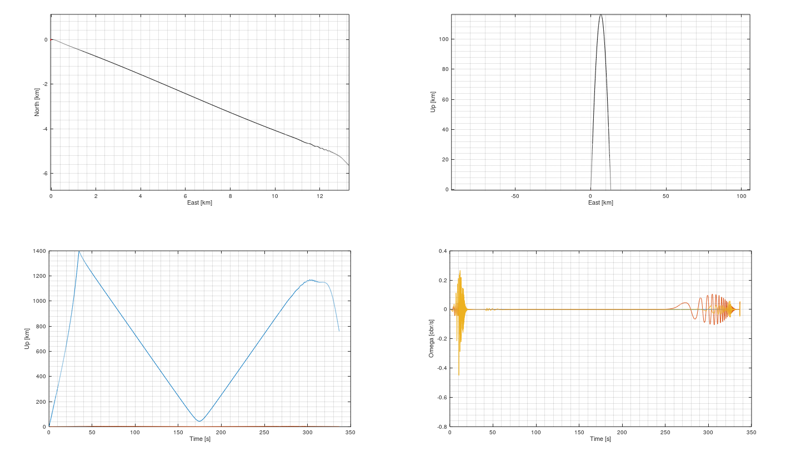

# 6dof_rocket_flight_simulator
6 Degrees Of Freedom simulator of rocket trajectrory

Matlab script to calculate a trajectory of a rocket influenced by a wind. 

main.m - main script to run the simulation \
config - folder containing config.m script with the launchpad, rocket and wind definition

Outputs: \
View of the trajectory in Earth centered coordination system:

3D view of the trajectory in local coordination system:

2D view of the trajectory in local coordination system:

